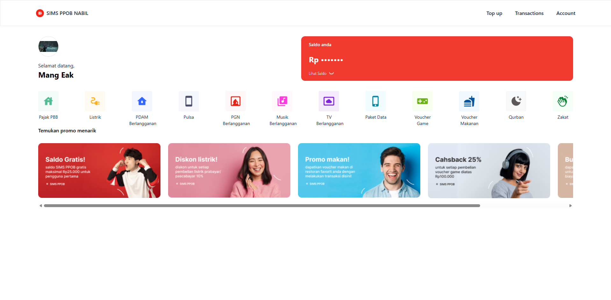

# SIMS PPOB - Nabil



Aplikasi _web_ SIMS PPOB (Payment Point Online Bank) ini dikembangkan sebagai bagian dari Take Home Test untuk posisi Front-End React.js Programmer di Nutech Integrasi. Aplikasi ini bertujuan untuk mendemonstrasikan pemahaman dalam mengembangkan _website_ dengan integrasi API, _state management_, serta penerapan UI/UX sesuai _mock up_ yang disediakan.

## Fitur Utama

Aplikasi ini memiliki beberapa fitur inti untuk mengelola akun pengguna dan transaksi PPOB:

1.  **Registrasi:** Mungkinkan pengguna baru membuat akun.
2.  **Login:** Mengautentikasi pengguna untuk mengakses fitur aplikasi.
3.  **Lihat Profile:** Menampilkan data profil pengguna.
4.  **Update Profile Data:** Mengizinkan pengguna memperbarui informasi pribadi mereka.
5.  **Update Profile Picture:** Mengizinkan pengguna mengubah foto profil.
6.  **Top Up:** Memungkinkan pengguna menambahkan saldo ke akun mereka.
7.  **Pembayaran:** Melakukan transaksi pembayaran untuk berbagai layanan (misal: listrik, pulsa).
8.  **Riwayat Transaksi:** Menampilkan daftar transaksi yang telah dilakukan pengguna.

## Persyaratan Teknis & Implementasi

- **Validasi Formulir:** Setiap _input_ formulir diimplementasikan dengan validasi yang sesuai.
- **State Management:** Menggunakan Redux Toolkit sebagai solusi _state management_ utama, sesuai dengan persyaratan untuk kandidat React.js.
- **Integrasi API:** Menggunakan API yang disediakan oleh Nutech Integrasi untuk semua fungsionalitas.
- **Responsivitas UI:** Tampilan aplikasi disesuaikan dengan _mock up_ yang diberikan.
- **Penanganan Respons API:** Aplikasi menangani respons dari API dengan memberikan notifikasi sukses atau gagal.

## Teknologi yang Digunakan

Proyek ini dibangun menggunakan _tech stack_ berikut:

- **Front-End Framework:** React (melalui Vite)
- **State Management:** Redux Toolkit
- **Styling:** Tailwind CSS
- **Icon Library:** Lucide React
- **Routing:** React Router DOM
- **Development Tools:** Vite, TypeScript, ESLint
- **Avatar Generation:** DiceBear (untuk _profile picture_ default)

## Cara Menjalankan Proyek Secara Lokal

Untuk menjalankan aplikasi ini di lingkungan lokal, ikuti langkah-langkah berikut:

1.  **Clone Repositori:**
    ```bash
    https
    git clone https://github.com/NabilBawahab/SIMS-PPOB-NABIL.git
    ssh
    git clone git@github.com:NabilBawahab/SIMS-PPOB-NABIL.git
    cd testnutech
    ```
2.  **Instal Dependensi:**
    ```bash
    npm install
    # atau
    yarn install
    ```
3.  **Jalankan Aplikasi:**
    ```bash
    npm run dev
    # atau
    yarn dev
    ```
    Aplikasi akan berjalan di `http://localhost:5173` (atau port lain yang tersedia).

## Deployment & Source Code

- **Aplikasi Ter-deploy:**
  https://sims-ppob-nabil.vercel.app/login
- **Source Code Repositori:**
  https://github.com/NabilBawahab/SIMS-PPOB-NABIL

---
